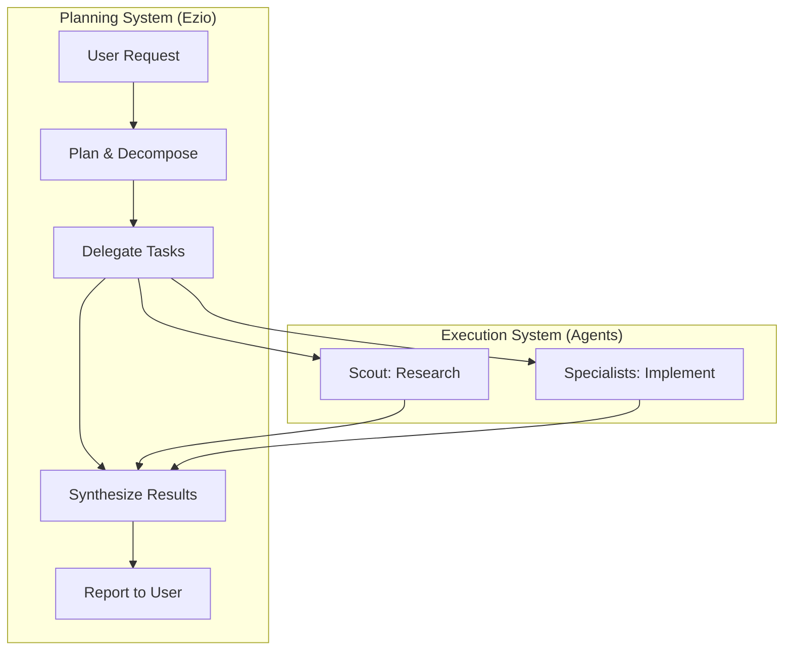
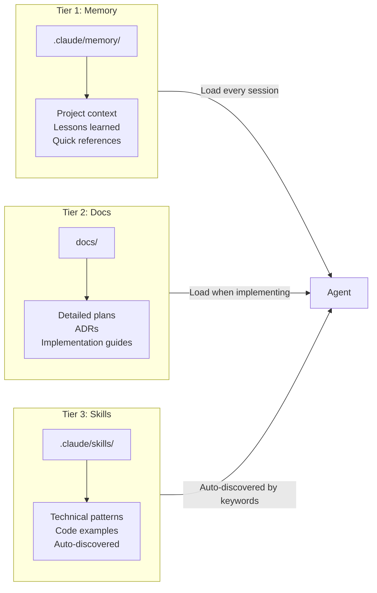

# Claude Code Multi-Agent Setup: Onboarding Guide

> **Version**: 1.1 | **Updated**: 2025-12-27 | **Status**: Active

Welcome! This guide helps you understand and customize this Claude Code setup. Whether you're using it as-is or adapting it for your own projects, you'll find everything you need here.

**New here?** Start with the [Quick Start](#quick-start-5-minutes), then try the [Hands-On Tutorial](TUTORIAL.md).

---

## How to Read This Guide

| Your Goal | Start Here |
|-----------|------------|
| Just want to use it | [Quick Start](#quick-start-5-minutes) |
| Understand how it works | [Architecture Overview](#architecture-overview) |
| Add your own agents/skills | [Customization Guide](#customization-guide) + [Templates](#starter-templates) |
| Hands-on learning | [Tutorial](TUTORIAL.md) |

---

## Table of Contents

1. [Quick Start (5 Minutes)](#quick-start-5-minutes)
2. [Think of It Like...](#think-of-it-like) *(plain English explanation)*
3. [Architecture Overview](#architecture-overview)
4. [Core Components](#core-components)
5. [Customization Guide](#customization-guide)
6. [Starter Templates](#starter-templates)
7. [Best Practices](#best-practices)
8. [Reference](#reference)
9. [Official Documentation & Citations](#official-documentation--citations)

---

## Quick Start (5 Minutes)

### What This Setup Provides

This is a **multi-agent orchestration framework** for Claude Code with:

- **8 specialized agents** with distinct roles (AI engineer, frontend, DevOps, QA, etc.)
- **Persistent memory** that survives across sessions
- **60+ skill patterns** auto-discovered by context keywords
- **7 mandatory rules** enforcing quality and consistency
- **Hook-based automation** for logging, validation, and context sharing

### How It Works

When you open Claude Code in this project:

1. **CLAUDE.md** is automatically loaded (universal project context)
2. **Rules** in `.claude/rules/` are auto-loaded (mandatory protocols)
3. **Skills** in `.claude/skills/` are auto-discovered based on keywords you mention
4. **Agents** in `.claude/agents/` can be delegated to via the Task tool

### Agent Cheat Sheet

| Nickname | Role | Use When |
|----------|------|----------|
| **Ezio** | Main Orchestrator | Coordinates all work, delegates to specialists |
| **Scout** | General Worker | Research, exploration, file reading, routine tasks |
| **Sage** | Solution Architect | Architecture decisions, design reviews |
| **Kai** | AI Engineer | Backend, APIs, AI agents (Python/FastAPI/ADK) |
| **Iris** | Frontend Engineer | UI components, React/TypeScript |
| **Devo** | DevOps Engineer | Infrastructure, deployment, CI/CD |
| **Vera** | QA Tester | Testing strategy, test automation |
| **Luna** | Frontend QA | Frontend tests, accessibility audits |

### Your First Task

Simply describe what you want. The orchestrator (Ezio) will:
1. Plan the work using TodoWrite
2. Delegate to Scout for research (if needed)
3. Delegate to specialists sequentially
4. Synthesize results and report back

```
User: "Add a new API endpoint for user profiles"

Ezio: [Plans task] → [Delegates to Scout for codebase research]
    → [Delegates to Kai for implementation] → [Reports completion]
```

---

## Think of It Like...

*Plain English explanations for the key concepts:*

### The Team Analogy

Imagine you hired a **small software team**:

| Team Member | Real-World Role | What They Do |
|-------------|-----------------|--------------|
| **Ezio** | Project Manager | Takes your request, breaks it into tasks, assigns work, reports back |
| **Scout** | Research Analyst | Explores the codebase, gathers information, prepares briefings |
| **Sage** | Tech Lead | Makes architecture decisions, reviews designs |
| **Kai** | Backend Developer | Writes Python code, APIs, AI integrations |
| **Iris** | Frontend Developer | Builds UI components, React pages |
| **Devo** | DevOps Engineer | Handles deployment, infrastructure |
| **Vera/Luna** | QA Engineers | Write tests, ensure quality |

You talk to Ezio (the project manager). Ezio coordinates the team. You don't need to manage individual developers.

### The Filing Cabinet Analogy

The setup uses a **three-tier filing system**:

| Drawer | What's Inside | When to Open |
|--------|---------------|--------------|
| **Memory** (top drawer) | Post-it notes, quick references | Every time you start work |
| **Docs** (middle drawer) | Full project plans, detailed guides | When you need specifics |
| **Skills** (bottom drawer) | Code recipes, patterns | Automatically when relevant |

**Memory** is like your team's sticky notes—quick reminders.
**Docs** is like the project binder—full details when needed.
**Skills** is like a cookbook—patterns you reach for when cooking specific dishes.

### The Rules vs Skills Distinction

Think of it like a **restaurant kitchen**:

- **Rules** = Health code regulations (MUST follow, no exceptions)
- **Skills** = Recipes (use when making that specific dish)

Rules apply always. Skills apply when relevant.

### Why Agents Have "Separate Brains"

Each agent has its **own context window** (memory space). Think of it like team members in different rooms:

- Ezio can't read Kai's notes directly
- When Ezio assigns work to Kai, he must explain everything
- This is why delegation includes full context

This design keeps each "room" uncluttered and focused.

---

## Architecture Overview

### The Two-System Principle

This setup implements a **separation between planning and execution**:



**Why this design?**
- **Context preservation**: Ezio's context stays strategic; raw data lives in agent contexts
- **Specialization**: Each agent has domain-specific knowledge and permissions
- **Quality control**: Sequential delegation allows review between steps
- **Scalability**: Add new specialists without changing orchestration logic

### Three-Tier Knowledge System



| Tier | Location | Size | Load Frequency |
|------|----------|------|----------------|
| **Memory** | `.claude/memory/` | 1-2 pages per agent | Every session |
| **Docs** | `docs/` | Unlimited | On-demand |
| **Skills** | `.claude/skills/` | Varies | Auto-discovered |

### File Structure Overview

```
.claude/
├── agents/           # 8 agent definitions (YAML frontmatter)
│   ├── orchestrator.md
│   ├── general-worker.md
│   ├── solution-architect.md
│   ├── ai-engineer.md
│   ├── frontend-engineer.md
│   ├── devops-engineer.md
│   ├── qa-tester.md
│   └── frontend-qa-specialist.md
│
├── rules/            # 7 mandatory protocols (auto-loaded)
│   ├── agent-delegation.md
│   ├── compression-protocol.md
│   ├── honest-feedback-protocol.md
│   ├── memory-protocol.md
│   ├── orchestrator-protocol.md
│   ├── pre-work-protocol.md
│   └── quality-gates.md
│
├── skills/           # 60+ technical patterns (auto-discovered)
│   ├── google-adk-patterns/
│   ├── deployment/
│   ├── testing-strategy/
│   ├── frontend-patterns/
│   └── ...
│
├── memory/           # Per-agent persistent context
│   ├── memory-orchestrator.md
│   ├── memory-general-worker.md
│   └── ...
│
├── hooks/            # Automation scripts
│   ├── setup-environment.sh
│   ├── tool_trace_logger.py
│   ├── session_analytics.py
│   └── ...
│
├── settings.json     # Hooks + permissions configuration
└── commands/         # Custom slash commands
```

---

## Core Components

### 1. CLAUDE.md (Universal Context)

**Location**: Project root (`/CLAUDE.md`)

This is the entry point that every agent sees. It contains:
- Agent identity map (nicknames → file paths)
- Core principles (simplicity, honest feedback, tech stack)
- Pre-work protocol (check skills first)
- Links to rules, skills, and memory

**Key insight from [Anthropic's best practices](https://www.anthropic.com/engineering/claude-code-best-practices)**: "Your CLAUDE.md files become part of Claude's prompts, so they should be refined like any frequently used prompt."

### 2. Agents (`.claude/agents/`)

Each agent file contains:
- **YAML frontmatter**: Name, description, tags for discovery
- **Identity**: Nickname and role
- **Instructions**: Specific protocols and responsibilities
- **Permissions**: What tools they can use

**Agent File Structure**:
```markdown
---
name: AI Engineer
description: Backend, AI agents, APIs (Python/FastAPI/ADK)
tags: [backend, python, fastapi, adk, ai]
---

# Kai - AI Engineer

## Identity
You are Kai, the AI Engineer...

## Responsibilities
- Backend development
- API design
- AI agent implementation

## Protocols
[Specific instructions for this agent]
```

**Design consideration**: Agents have **independent context windows**. When delegated to, they start fresh—they cannot see the conversation history. This is why the delegation protocol requires complete context in every handoff.

### 3. Rules (`.claude/rules/`)

Rules are **auto-loaded** and enforce mandatory behaviors. Current rules:

| Rule | Purpose |
|------|---------|
| `agent-delegation.md` | How Ezio delegates (sequential, complete context) |
| `compression-protocol.md` | Response format (summaries, not raw data) |
| `honest-feedback-protocol.md` | Anti-sycophancy (challenge ideas, state confidence) |
| `memory-protocol.md` | Persistent learning (STAR format for lessons) |
| `orchestrator-protocol.md` | Ezio's workflow (plan, delegate, synthesize) |
| `pre-work-protocol.md` | Skills-first mandate (check patterns before coding) |
| `quality-gates.md` | Code review checklists |

**Design consideration**: Rules are **mandatory** (auto-loaded), while skills are **optional** (auto-discovered by keywords). This ensures critical protocols are always followed while keeping context lean for domain-specific patterns.

### 4. Skills (`.claude/skills/`)

Skills contain **reusable technical patterns** organized by domain:

| Domain | Examples |
|--------|----------|
| `google-adk-patterns/` | ADK agents, events, state management, tools |
| `deployment/` | Cloud Run, Terraform, OAuth configuration |
| `testing-strategy/` | Unit tests, E2E, accessibility, security |
| `frontend-patterns/` | React components, routing, state, forms |
| `llm-evaluation/` | DeepEval, RAGAS, evaluation frameworks |
| `llm-observability/` | Langfuse, Phoenix, tracing setup |

**Skill File Structure** (with YAML frontmatter):
```markdown
---
name: ADK Event Persistence
description: Patterns for persisting ADK events to storage
tags: [adk, events, gcs, persistence]
context7_libraries: ["/google/adk-python"]
last_verified: 2025-12-15
---

# ADK Event Persistence

## Pattern
[Technical pattern with code examples]

## When to Use
[Context for when this pattern applies]

## Example
[Working code example]
```

**Auto-discovery**: Claude automatically discovers relevant skills based on keywords in your conversation. Mentioning "ADK event persistence" triggers discovery of that skill file.

### 5. Memory (`.claude/memory/`)

Each agent maintains a **persistent memory file** that survives across sessions:

**Memory Philosophy**: Memory is a **contextualized index** (1-2 pages max), NOT detailed documentation:
- High-level status and context
- Brief decision rationale (1-2 lines)
- Pointers to detailed docs
- Lessons learned in STAR format

**STAR Format** for significant learnings:
```markdown
### Bug: API returning empty response (2025-12-20)
**Situation**: GET /users returned 200 but empty body
**Task**: Fix the response serialization
**Action**: Added explicit model_dump() before JSONResponse
**Result**: Response now returns full user object
**Fix**: user_router.py:45
**Pattern**: Always serialize Pydantic models explicitly
```

### 6. Hooks (`.claude/hooks/` + `settings.json`)

Hooks provide **automation and observability**. Configured in `.claude/settings.json`:

```json
{
  "hooks": {
    "SessionStart": [
      { "type": "command", "command": ".claude/hooks/setup-environment.sh" }
    ],
    "PostToolUse": [
      {
        "matcher": "*",
        "hooks": [
          { "type": "command", "command": "python .claude/hooks/tool_trace_logger.py" }
        ]
      }
    ]
  }
}
```

**Hook Events** ([official docs](https://docs.anthropic.com/en/docs/claude-code/hooks)):

| Event | When | Use For |
|-------|------|---------|
| `SessionStart` | Session begins | Environment setup, memory loading |
| `PreToolUse` | Before tool runs | Validation, blocking sensitive operations |
| `PostToolUse` | After tool completes | Logging, formatting, context sharing |
| `Stop` | Before ending | Work validation (uses LLM prompt) |
| `SessionEnd` | Session ends | Analytics, memory updates |

---

## Customization Guide

### Adding a New Agent

1. **Create agent file**: `.claude/agents/new-agent.md`

```markdown
---
name: Security Engineer
description: Security audits, vulnerability assessment, threat modeling
tags: [security, audit, vulnerability, threat-model]
---

# Nova - Security Engineer

## Identity
You are Nova, the Security Engineer for your project.

## Responsibilities
- Security code reviews
- Vulnerability assessments
- Threat modeling
- Security best practices enforcement

## Protocols
- Always check OWASP Top 10 vulnerabilities
- Document security findings with severity levels
- Follow the compression protocol for reports
```

2. **Add to CLAUDE.md agent map**:
```markdown
| **Nova** | Security Engineer | `.claude/agents/security-engineer.md` |
```

3. **Create memory file**: `.claude/memory/memory-security-engineer.md`

4. **Add to delegation rules** (if orchestrated by Ezio)

### Creating Skills (4 Complexity Levels)

See [skill-complexity-levels.md](skill-complexity-levels.md) for detailed guidance:

| Level | Complexity | Example |
|-------|------------|---------|
| **1** | Single pattern, <100 lines | `api-pagination.md` |
| **2** | Multi-pattern, 100-500 lines | `authentication-patterns.md` |
| **3** | Domain with subdirectory | `testing-strategy/` (13 files) |
| **4** | Multi-domain ecosystem | `google-adk-patterns/` (8 files) |

**Skill frontmatter template**:
```yaml
---
name: [Descriptive Name]
description: [What patterns this covers]
tags: [keyword1, keyword2, keyword3]
context7_libraries: ["/org/repo"]  # Optional: for external docs
last_verified: YYYY-MM-DD
---
```

### Writing Rules

Rules are for **mandatory behaviors** that must always apply:

```markdown
# [Rule Name] (Mandatory)

**Purpose**: [Why this rule exists]

## When This Applies
[Conditions that trigger this rule]

## Requirements
1. [Requirement 1]
2. [Requirement 2]

## Anti-Patterns (Avoid)
- [What NOT to do]

## Examples
[Good vs bad examples]
```

**Rule vs Skill decision**:
- **Rule**: Must always be followed (auto-loaded)
- **Skill**: Domain-specific pattern (auto-discovered)

---

## Starter Templates

We provide ready-to-use templates for creating new components. Copy, customize, and you're done.

### Available Templates

| Template | Location | Use For |
|----------|----------|---------|
| **Agent** | `.claude/templates/agent-template.md` | Creating new specialist agents |
| **Skill** | `.claude/templates/skill-template.md` | Adding technical patterns |
| **Rule** | `.claude/templates/rule-template.md` | Enforcing mandatory behaviors |
| **Memory** | `.claude/templates/memory-template.md` | Agent persistent context |

### Quick Start with Templates

**Adding a new agent:**
```bash
# 1. Copy the template
cp .claude/templates/agent-template.md .claude/agents/my-agent.md

# 2. Edit with your agent's details
# 3. Add to CLAUDE.md agent map
# 4. Create memory file
cp .claude/templates/memory-template.md .claude/memory/memory-my-agent.md
```

**Adding a new skill:**
```bash
# 1. Copy the template
cp .claude/templates/skill-template.md .claude/skills/my-pattern.md

# 2. Fill in the YAML frontmatter (name, description, tags)
# 3. Add your patterns and examples
# 4. Test by mentioning keywords in conversation
```

Each template includes:
- Complete structure with placeholders
- Inline documentation explaining each section
- Checklist of follow-up steps
- Examples of good patterns

**See [TUTORIAL.md](TUTORIAL.md)** for step-by-step walkthroughs of creating agents and skills.

---

### Configuring Hooks

Add hooks to `.claude/settings.json`:

```json
{
  "hooks": {
    "PreToolUse": [
      {
        "matcher": "Write|Edit",
        "hooks": [
          {
            "type": "command",
            "command": "python .claude/hooks/validate-file.py"
          }
        ]
      }
    ]
  }
}
```

**Hook script input**: Hooks receive JSON via stdin with context:
```json
{
  "session_id": "abc123",
  "tool_name": "Write",
  "tool_input": { "file_path": "/path/to/file.py", "content": "..." }
}
```

**Hook script output**: Return JSON to control behavior:
```json
{
  "hookSpecificOutput": {
    "permissionDecision": "allow",  // or "deny"
    "permissionDecisionReason": "File validation passed"
  }
}
```

---

## Best Practices

### 1. Scout First, Implement Second

Before asking specialists to implement, delegate to Scout for research:
```
1. Scout explores codebase → returns compressed findings
2. Ezio reviews and synthesizes
3. Specialist implements with full context
```

This preserves orchestrator context and ensures specialists have what they need.

### 2. Keep Memory Lean

Memory files should be **1-2 pages max**. Use them as indexes:
- Brief context and status
- Pointers to detailed docs in `docs/`
- Lessons learned (STAR format)

**Don't**: Paste full code examples or detailed implementation steps

### 3. Skill Discovery Keywords

Help Claude discover relevant skills by mentioning keywords:
- "I need to implement ADK event persistence" → triggers `google-adk-patterns/`
- "Set up Cloud Run deployment" → triggers `deployment/`
- "Add E2E tests" → triggers `testing-strategy/`

### 4. Compression in Responses

Agents should return **synthesized insights**, not raw data:

**Bad**: "Here are the contents of the 500-line file..."
**Good**: "The auth module uses JWT with 15-minute expiry. Key locations: `auth_service.py:45-67` (token generation), `middleware.py:23-40` (validation)."

### 5. Challenge Ideas, Don't Validate

The honest feedback protocol requires stating confidence levels:
- "I'm confident this approach will work because..."
- "I have reservations about the caching strategy—specifically..."
- "I disagree with this approach because..."

---

## Reference

### Agent to subagent_type Mapping

When using the Task tool, use these exact `subagent_type` values:

| Nickname | subagent_type (exact) |
|----------|----------------------|
| Scout | `General Worker` |
| Sage | `Solution Architect` |
| Kai | `AI Engineer` |
| Iris | `Frontend Engineer` |
| Devo | `DevOps Engineer` |
| Vera | `QA Tester` |
| Luna | `Frontend QA Specialist` |
| Ezio | `Main Orchestrator` |

### File Location Reference

| Component | Location | Discovery |
|-----------|----------|-----------|
| Universal context | `/CLAUDE.md` | Auto-loaded |
| Project guidelines | `/PROJECT_GUIDELINES.md` | Referenced in CLAUDE.md |
| Agents | `.claude/agents/*.md` | Via Task tool |
| Rules | `.claude/rules/*.md` | Auto-loaded |
| Skills | `.claude/skills/**/*.md` | Auto-discovered |
| Memory | `.claude/memory/*.md` | Per-agent |
| Hooks config | `.claude/settings.json` | Auto-loaded |
| Hook scripts | `.claude/hooks/` | Called by settings |
| Detailed docs | `docs/` | On-demand |

### Troubleshooting

| Issue | Solution |
|-------|----------|
| Agent doesn't know context | Provide complete context in delegation prompt |
| Skill not discovered | Mention relevant keywords; check frontmatter tags |
| Rule not applied | Verify file is in `.claude/rules/` with `.md` extension |
| Hook not running | Check `settings.json` syntax; verify script is executable |
| Memory too large | Archive to `docs/archive/`, keep memory as index |

---

## Official Documentation & Citations

### Anthropic Resources
- [Claude Code: Best Practices](https://www.anthropic.com/engineering/claude-code-best-practices) - Official best practices guide
- [Hooks Reference](https://docs.anthropic.com/en/docs/claude-code/hooks) - Complete hooks documentation
- [Subagents Documentation](https://code.claude.com/docs/en/sub-agents) - Multi-agent setup guide
- [Claude Code Plugins](https://www.anthropic.com/news/claude-code-plugins) - Plugin system documentation

### Community Resources
- [Claude Code Cheat Sheet](https://shipyard.build/blog/claude-code-cheat-sheet/) - Commands and best practices
- [Awesome Claude Code](https://github.com/hesreallyhim/awesome-claude-code) - Curated list of workflows
- [Claude Code Customization Guide](https://alexop.dev/posts/claude-code-customization-guide-claudemd-skills-subagents/) - Skills and subagents explained

### Key Concepts from Official Docs

**On CLAUDE.md**: "CLAUDE.md files become part of Claude's prompts, so they should be refined like any frequently used prompt." ([Source](https://www.anthropic.com/engineering/claude-code-best-practices))

**On Subagents**: "Sub-agents are specialized mini-agents with their own system prompt, tool permissions, and independent context window. They reduce context pollution and enable scalable, repeatable workflows." ([Source](https://code.claude.com/docs/en/sub-agents))

**On Hooks**: "Hooks are critical for steering Claude in complex enterprise repos. They are the deterministic 'must-do' rules that complement the 'should-do' suggestions in CLAUDE.md." ([Source](https://www.anthropic.com/engineering/claude-code-best-practices))

---

## Next Steps

### For New Users

1. **Try the Tutorial**: Work through [TUTORIAL.md](TUTORIAL.md) for hands-on learning
2. **Run a simple task**: Ask for a feature and watch the orchestration
3. **Explore `.claude/`**: Browse to see how components connect

### For Customizers

1. **Use the templates**: Copy from `.claude/templates/` to create new components
2. **Add your tech stack**: Create skills for your frameworks and patterns
3. **Extend the team**: Add agents for your specific roles (Security, Data, etc.)

### Quick Links

| Resource | Purpose |
|----------|---------|
| [TUTORIAL.md](TUTORIAL.md) | Step-by-step hands-on guide |
| [.claude/templates/](.claude/templates/) | Starter templates for customization |
| [SKILLS_AND_AGENTS_GUIDE.md](SKILLS_AND_AGENTS_GUIDE.md) | Deep dive on the knowledge system |
| [rules-reference.md](rules-reference.md) | Complete rules documentation |
| [skill-complexity-levels.md](skill-complexity-levels.md) | Skill creation guidance |

### Getting Help

- Check [Troubleshooting](#troubleshooting) for common issues
- See [Official Documentation](#official-documentation--citations) for Claude Code resources
- Explore existing agents/skills as examples
